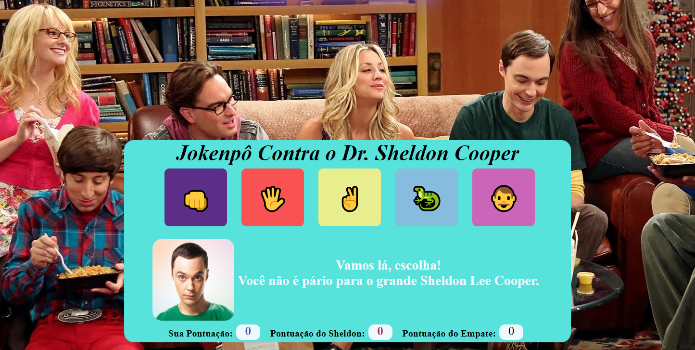

https://github.com/igorlazzaretti/Desafio-JokenpoTBBT-DevClub/assets/134664486/9bdc0e29-9906-41b1-b2fe-8722bbfe94c8

## Desafio-JokenpoTBBT-DevClub
<a target="_blank" href="https://igorlazzaretti.github.io/Desafio-JokenpoTBBT-DevClub/">👨‍💻 Deploy do Projeto</a>

## Imagens do projeto

## Sobre o Projeto
 Desafio Javascript + HTML + CSS. Jogo de Jokenpo utilizando tecnologias recentemente aprendidads no curso Desenvolvedor FullStack do DevClub com o professor Rodolfo Mori.

 <a href="https://rodolfomori.com.br/links/" target="_blank">Rodolfo Mori</a>

## Tecnologias Utilizadas

  &nbsp;
  &nbsp;
  &nbsp;
  

## Sobre o Autor

🧙‍♂️ Fâ de Harry Potter   
🎓 Análise de Sistemas - Cruzeiro do Sul  
💻 Estudante FullStack: Dio.me / DevClub  
👩🏻‍💻 Autor do Site: <a href="https://igorlazzaretti.com/">igorlazzaretti.com</a>
 
📚 Leitor e Estudante de Outras Linguas   

##

> "Acredite nos seus sonhos"   - Igor Dossin Lazzaretti

